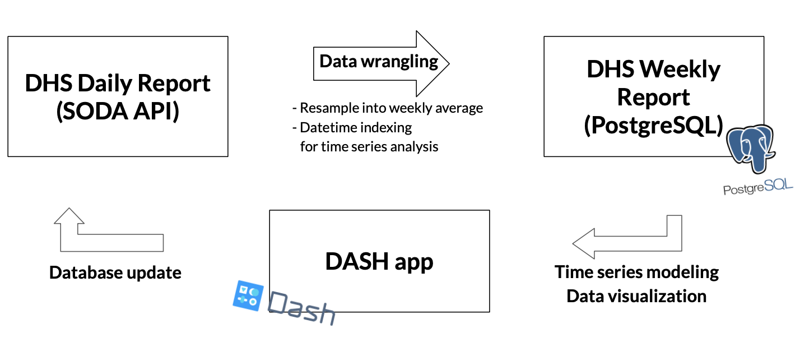
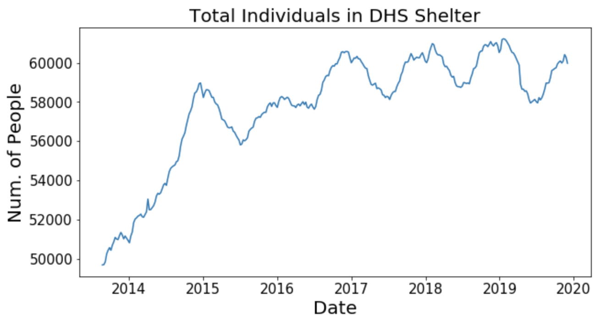
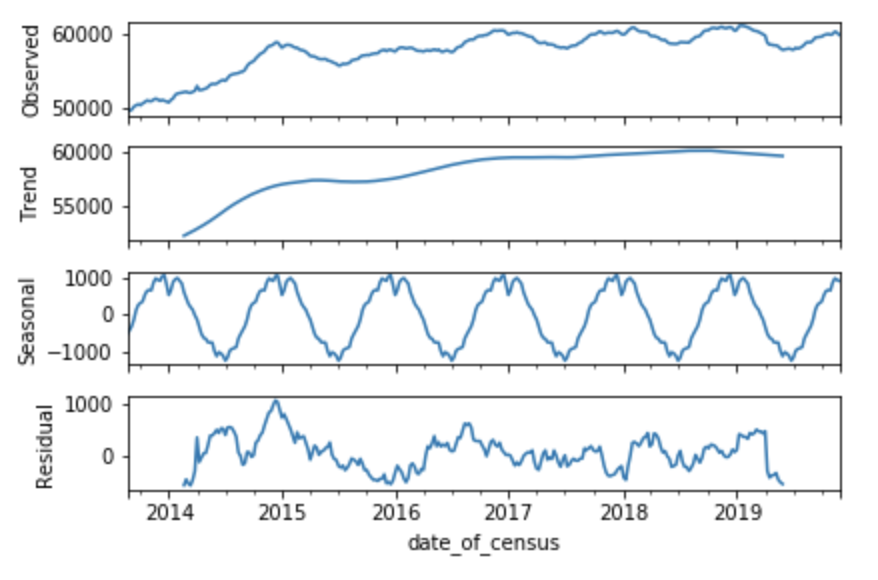

# nyc_homeless_pop_prediction

## Problem Statement

In this project, I built a time series model to forecast the total number of individuals sheltered by the NYC Department of Homeless Services (DHS). I used DHS Daily Report publicly available from [NYC Open Data](https://opendata.cityofnewyork.us) to build Time Series model. I aimed to help understand homeless communities better by examining different factors that change the number of individuals in DHS shelter and to help better prepare for those who are in need of a space at a shelter by forecasting the general demand.

---

## About This Repository

This project is comprise of four big parts.

1) [Database construction](https://github.com/dae-han/nyc_homeless_pop_prediction/blob/master/production/1_Data_Wrangling%2BDatabase_Construction.ipynb)
2) [Exploratory data analysis (EDA)](https://github.com/dae-han/nyc_homeless_pop_prediction/blob/master/production/3_EDA.ipynb)
3) [Modeling](https://github.com/dae-han/nyc_homeless_pop_prediction/blob/master/production/4_SARIMA_Time_Series_Analysis.ipynb)
4) [Deployment](https://github.com/dae-han/nyc_homeless_pop_prediction/blob/master/production/dash_app/run.py)
## Executive Summary

### 1. Database Construction

The homeless shelter population is documented on DHS Daily Report and it is updated daily on [NYC Open Data](https://opendata.cityofnewyork.us) website. The data from the report can be accessed through Socrata Open Data API (SODA). This dataset contains the number of individuals sheltered by DHS and their demographic breakdowns such as total number of women or total number of children.

Database was constructed to prevent data loss and to accumulate all updated data. The number of data that can be scraped each time is limited and this means as new data is updated, older data can not be accessed. In order to prevent this, datasets that were scraped initially were added to the database and the daily update was added to the dataset.

### 2. Exploratory Data Analysis and Modeling

