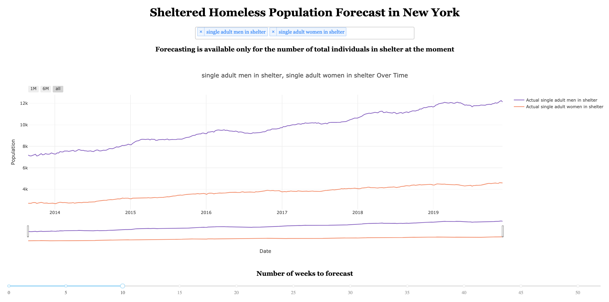

# Predicting the Demand for Homeless Shelter

## Problem Statement

In this project, I built a time series model to forecast the total number of individuals sheltered by the NYC Department of Homeless Services (DHS). I used DHS Daily Report publicly available from [NYC Open Data](https://opendata.cityofnewyork.us) to build Time Series model. I aimed to help understand homeless communities better by examining different factors that change the number of individuals in DHS shelter and to help better prepare for those who are in need of a space at a shelter by forecasting the general demand.

---

## About This Repository

This project is comprise of four big parts.

1) [Database construction](https://github.com/dae-han/nyc_homeless_pop_prediction/blob/master/production/1_Data_Wrangling%2BDatabase_Construction.ipynb)
2) [Exploratory data analysis (EDA)](https://github.com/dae-han/nyc_homeless_pop_prediction/blob/master/production/3_EDA.ipynb)
3) [Modeling](https://github.com/dae-han/nyc_homeless_pop_prediction/blob/master/production/4_SARIMA_Time_Series_Analysis.ipynb)
4) [Deployment](https://github.com/dae-han/nyc_homeless_pop_prediction/blob/master/production/dash_app/run.py)
## Executive Summary

### 1. Database Construction

The homeless shelter population is documented on DHS Daily Report and it is updated daily on [NYC Open Data](https://opendata.cityofnewyork.us) website. The data from the report can be accessed through Socrata Open Data API (SODA). This dataset contains the number of individuals sheltered by DHS and their demographic breakdowns such as total number of women or total number of children.

Database was constructed to prevent data loss and to accumulate all updated data. The number of data that can be scraped each time is limited and this means as new data is updated, older data can not be accessed. In order to prevent this, datasets that were scraped initially were added to the database and the daily update was added to the dataset.

### 2. Exploratory Data Analysis (EDA)

The total individuals in DHS Shelter increased rapidly from 2014 to 2015 and showed gradual increase until 2017. From 2017 until now, the upward trend has been stagnant.

This dataset also exhibit a seasonal trend or seasonality. Towards the end of each year through the beginning of the next year, the population in the shelter increases.

### 3. Modeling

In order to build a time series model, three terms, `p`, `d`, and `q` was defined.

`p` (AR: AutoRegression)
- The term `p` is used to have the model comprehend a long term trend in the data. The Partial Autocorrelation Function (PACF) plot below can be used to identify the term `p`. In the PACF plot below, a sharp cut-off in lag 3 was identifed. Lag 1 value was positive and, in such pattern, `p` term is the lag right before the sharpt cut-off. Therefore, **`p` was selected to be 1**

`d` (I: Integration)
- The term `d` is used to make the data stationary. Augmented Dickey-Fuller (ADF) Test was used to determine if the data was stationary. If the ADF test result indicated that the data was not stationary, the data was differenced until stationarity was observed. For the weekly DHS shelter population dataset, stationarity was observed when the dataset was differenced once. Therefore, **`d` was selected to be 1**.

`q` (MA: Moving Average)
- The term `q` is used to help the model understand short and sudden fluctuation in the dataset. In order to determine the term `q`, Autocorrelation Fucntion (ACF) plot can be used. In ACF plot below, no sharp cut-off was observed, which indicates that there is no sudden fluctuation in the data for the model to learn. Therefore, **`q` is selected to be 0**.

---

> **ARIMA (1, 1, 0) model**

- The prediction converged quickly and failed to make meaningful predictions.
- Root mean square error (RMSE): 1834

---

> **SARIMA (1, 1, 0) x (2, 2, 0, 51)**

- Grid Search was used to find the seasonal order terms that optimizes the result.
- Using seasonal order terms significantly improved the performance of the model.
- Root mean square error (RMSE): 560

### 4. Deployment

For the visualization of the model, I used [Dash by Plotly](https://plot.ly/dash/).

#### Opening page

#### Making Prediction

## Next Step

#### Forecast demographic breakdowns

Currently, forecasting is available for the total number of individuals in the DHS shelter but not for the demographic breakdowns. By building a time series model for each demographic breakdown categories, we can forecast the demographic breakdowns as well. This can help us better understand the changes in certain group's representation in the homeless shelter over time, providing insights to the homeless issue in New York.

#### Try exogenous features (VAR model)

While SARIMA model uses the target's past trends to make predictions, different features can also be used to help make better predictions, if the features are affected by or affect the target feature's trends. The different feature or features are called 'exogenous features'. Example of some of the exogenous features that can be tested are, housing affordability, national medical debt or natural language analysis such as sentiment analysis on social media posts discussing homelessness.

What makes it difficult to incorporate exogenous features is that weekly updates needs to be available for the exogenous features. The current model uses the target variable from a data source that provides daily updates and the data is resampled into a weekly average dataset. If any of the exogenous features fails to provide weekly update, the model will fail to make the predictions. In order to tackle this issue, I plan to use shell-scripting to automate the web-scraping process and scrape the daily regularly.

## Source

1. [NYC Open Data](https://opendata.cityofnewyork.us)
2. [Dash by Plotly](https://plot.ly/dash/)
3. [Coalition for the homeless](https://www.coalitionforthehomelss.org)
